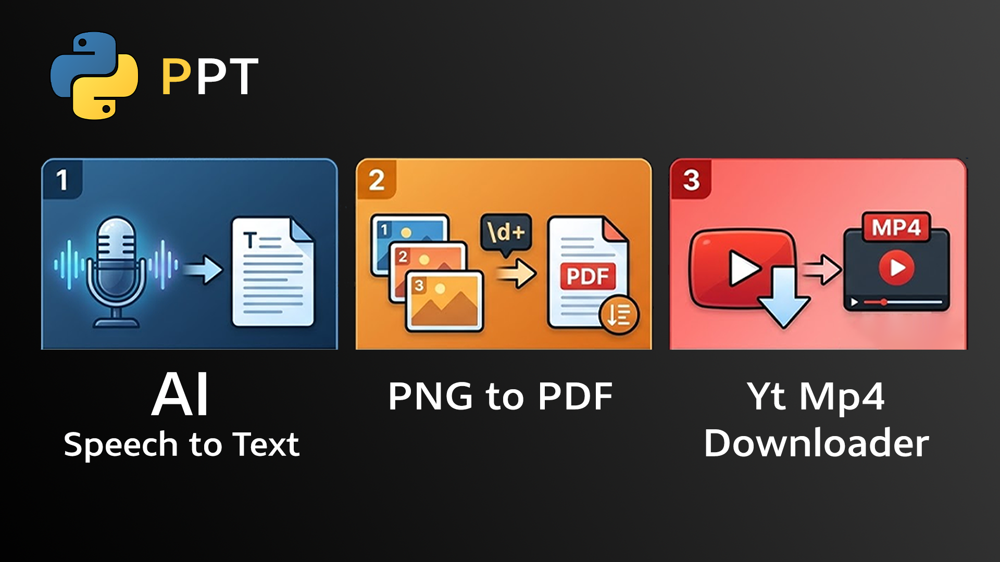

Bu repo, günlük akademik ve içerik üretim süreçlerimi hızlandırmak için geliştirdiğim yardımcı araçları içerir.

Smart PNG to PDF Converter (`png_to_pdf.py`)
Görsel dosyalarını, dosya isimlerindeki sayısal hiyerarşiyi (Regex kullanarak) koruyarak birleştirir ve PDF'e dönüştürür. 

YouTube Video Downloader
YouTube içeriklerini yüksek kalitede indiren ve FFmpeg ile birleştiren otomasyon betiği.

AI Speech-to-Text Transcriber
OpenAI'ın Whisper modelini kullanarak ses dosyalarını otomatik olarak metne dönüştürür. Özellikle içerik üreticileri için altyazı hazırlama sürecini otomatize etmek amacıyla geliştirilmiştir.
